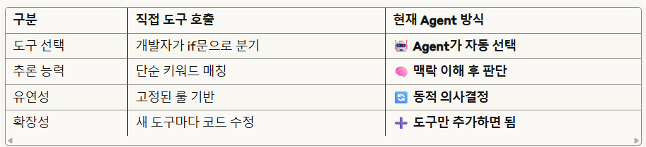

# 📊 AI 기반 홈쇼핑 방송 전략 추천 시스템 (Agent 기반 MVP)

> 사용자 질문을 기반으로 날씨, 트렌드, 재고 데이터를 활용하여 자동으로 방송 전략을 추천합니다.  
> 또한 GPT와 Azure Vision API를 통해 상품 이미지 카테고리 분류도 자동화합니다.

---

## 🚀 실행 방법

### 1. 패키지 설치
```bash
pip install -r requirements.txt
```
### 2. 환경변수 설정
.env.sample → .env로 복사하고 다음 키를 설정합니다:
```
# OpenAI API
OPENAI_API_KEY="your_openai_api_key"

# Tavily Search API (날씨/트렌드 검색)
TAVILY_API_KEY="your_tavily_api_key"

# Azure Computer Vision (이미지 분석)
VISION_ENDPOINT="https://your-vision-endpoint.cognitiveservices.azure.com/"
VISION_API_KEY="your_azure_vision_api_key"

# PlanetScale MySQL Database
MYSQL_USERNAME="your_mysql_username"
MYSQL_PASSWORD="your_mysql_password"
MYSQL_HOST="your_mysql_host"
MYSQL_PORT="3306"
MYSQL_DATABASE="your_database_name"
```
### 3. 실행
```
streamlit run app.py
```
브라우저에서 http://localhost:8501로 접속하여 애플리케이션을 사용하세요.

## ✅ 핵심 기능 (MVP 기준)
| 분류                | 설명                                                   |
| ----------------- | ---------------------------------------------------- |
| 💡 Agent 기반 질문 대응 | 사용자가 날씨/트렌드/전략 관련 질문을 하면 Agent가 적절한 Tool을 자동 선택하여 실행 |
| 🔎 날씨·트렌드 검색      | Tavily API를 통해 일자 기반 검색 쿼리 생성 및 요약                   |
| 🧠 GPT 전략 생성      | 재고, 트렌드, 날씨를 반영하여 마케팅 전략 자동 생성                       |
| 🖼️ 상품 이미지 분류     | Azure OCR + Vision + GPT 기반 상품 카테고리 추론 (3단계)         |
| 🗃️ 분류 결과 DB 저장   | 분류된 결과를 MySQL의 `product_classifications` 테이블에 저장     |
| 📈 카테고리 분석 대시보드   | 카테고리별 분포 및 최근 분류 결과 시각화 (Plotly 포함)                  |

## 🧠 시스템 아키텍처

LLM은 자연어 질문을 이해하고 Tool 실행 결과를 종합합니다
Agent는 질문 의도를 분류하고 각 Tool을 선택하여 실행
Tools:
WeatherService: 날씨 API 검색 및 요약
Vector DB: GPT 상품 추출 + 재고 유사도 기반 검색
GoogleSearch: 트렌드 키워드 자동 검색

### Agent 기반 처리 흐름
```
사용자 질문 → Agent 질문 분류 → 전용 Tool 선택 → 결과 처리 → UI 표시
     ↓              ↓                ↓              ↓           ↓
  "내일 날씨"    weather_tool     Tavily API    세션 저장    날씨 UI
  "상품 추천"    strategy_tool    재고 매칭     전략 생성    전략 UI
  "트렌드"       trend_tool       RSS 수집      요약 처리    트렌드 UI
```

### 🔍 LangChain Agent 사용 
#### 1. Agent 초기화 부분
```
# LangChain Agent 초기화
agent = initialize_agent(
    tools,                                    # 도구들 등록
    llm,                                     # LLM 모델
    agent=AgentType.ZERO_SHOT_REACT_DESCRIPTION,  # ReAct 패턴 Agent
    verbose=False,
    max_iterations=2,
    early_stopping_method="generate",
    handle_parsing_errors=True
)
```
#### 2. Agent 실행 부분
```
# 🤖 LangChain Agent가 자동으로 도구 선택
result = agent.run(user_question)  # ← 진짜 Agent 실행!
```
#### 3. ReAct 패턴 작동 방식
현재 Agent는 ReAct (Reasoning + Acting) 패턴으로 작동합니다:
- 사용자 질문 분석 → "내일 날씨 어때?"
- 추론(Reasoning) → "이건 날씨 관련 질문이네"
- 행동(Acting) → weather_tool 선택하여 실행
- 관찰(Observation) → 도구 실행 결과 확인
- 최종 응답 → 결과를 바탕으로 자연스러운 답변 생성

#### 🤖 Agent의 실제 동작 과정
#### 예시: "내일 날씨 어때?" 입력시
```
🤖 Agent 내부 처리:
1. 질문 분석: "날씨에 관한 질문이구나"
2. 도구 선택: weather_tool이 적합하다고 판단
3. 도구 실행: weather_tool(user_question) 호출
4. 결과 처리: 도구 결과를 바탕으로 자연스러운 답변 생성
5. 세션 상태: last_tool_used="weather", tool_execution_status="success"
```
#### 📊 Agent vs 직접 호출 비교


#### 🔧 Agent 작동 확인 방법
#### 콘솔 로그를 보면 Agent의 실제 동작을 확인할 수 있습니다:
```
print(f"Agent 결과: {result}")                    # Agent 최종 응답
print(f"사용된 도구: {st.session_state.last_tool_used}")  # Agent가 선택한 도구
print(f"실행 상태: {st.session_state.tool_execution_status}")  # 실행 결과
```
#### 💡 Agent의 지능적 판단 예시
- "비올 것 같은데 우산 팔면 좋을까?" → strategy_tool 선택 (상품 전략)
- "내일 날씨 어때?" → weather_tool 선택 (날씨 조회)
- "요즘 뭐가 인기야?" → trend_tool 선택 (트렌드 분석)

### ✅ 결론
- agent.run()으로 실행 ✅
- ReAct 패턴으로 추론 ✅
- 자동 도구 선택 ✅
- 맥락적 의사결정 ✅


### 데이터 처리 파이프라인
```
┌─────────────┐    ┌──────────────┐    ┌─────────────┐    ┌──────────────┐
│ 사용자 입력 │───▶│ Agent 분석   │───▶│ Tool 실행   │───▶│ 결과 표시    │
│ • 질문      │    │ • 의도 파악  │    │ • API 호출  │    │ • UI 렌더링  │
│ • 이미지    │    │ • Tool 선택  │    │ • DB 조회   │    │ • 세션 저장  │
└─────────────┘    └──────────────┘    └─────────────┘    └──────────────┘
```

🗂️ 디렉토리 구조
```
AI_Sales_Insite/
├── app.py                      # Streamlit 메인 실행 파일
├── pipelines/
│   ├── query_pipeline.py       # SQL 실행 및 재고 조회
│   └── connect_db_engine.py    # PlanetScale DB 연결
├── vision_pipeline/            # 이미지 분류 및 Vision + GPT 기반 태깅
├── external_utils/
│   └── date_keywords.py        # 날짜 키워드 파싱 → 쿼리 생성
├── data/                       # 예시 이미지 또는 분석 결과
├── .env.sample                 # 환경변수 예시
├── README.md
└── requirements.txt

```
## 🔧 주요 기술 스택
- LLM / GPT: OpenAI ChatGPT API (gpt-4o)
- LangChain Agent: Tool 분기 및 실행 흐름 자동화
- Azure Vision / OCR: 이미지 내 텍스트 추출 및 태그 분석
- Tavily: 트렌드 및 날씨 검색 API
- MySQL (PlanetScale): 재고 및 분류 결과 저장
- Streamlit: 인터랙티브 웹 UI
- Langchain Embeddings + CosineSimilarity: 재고 유사도 기반 매칭